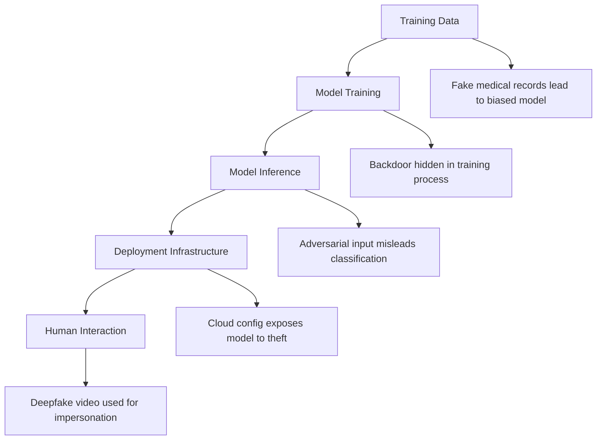

# AI Attack Surface: A Red Teamer’s Perspective

As AI systems become foundational to decision-making, automation, and digital experiences, understanding their **full attack surface** is critical. AI systems are not just about models—they are complex pipelines spanning data, code, infrastructure, and people.

From a red teamer's perspective, each stage of the AI lifecycle represents a **distinct attack opportunity**. Let’s walk through these stages and examine how adversaries may exploit them.

---

## Where Security and Safety Issues Can Be Introduced

AI systems are built step by step. At each step, there is a chance something can go wrong—either by mistake or due to an attack. Here's where problems can be introduced and one example for each stage:

| Stage                         | What Can Go Wrong               | Example                                                |
| ----------------------------- | ------------------------------- | ------------------------------------------------------ |
| **Training Data**             | Fake or bad data added          | Wrong medical records lead to wrong AI advice          |
| **Model Training**            | Hidden code or backdoors        | AI works normally, but gives wrong answers to triggers |
| **Model Inference**           | Tricked by smart inputs         | AI mislabels a picture because of hidden changes       |
| **Deployment Infrastructure** | Hacked servers or cloud systems | AI model is stolen from a cloud account                |
| **Human Interaction**         | Users tricked by AI outputs     | AI-generated scam messages fool people                 |

---

## Attack Surface Breakdown

### 1. Training Data

Corrupting a model starts with its foundation—**the data**. Poisoned or manipulated data can bias the model or implant subtle malicious behaviors.

**Threats:**

* Data poisoning
* Tampered labeling processes
* Ingesting untrusted third-party datasets

**Red Team Insight:** Attackers aim to be “invisible chefs”—corrupt the ingredients, not just the meal.

---

### 2. Model Training

The model-building stage is rich with opportunity—especially when open-source libraries or distributed training processes are involved.

**Threats:**

* Supply chain compromise (malicious libraries)
* Backdooring in federated learning
* Training environment compromise

**Initial Check:** Are you verifying the integrity of every dependency and isolating compute resources?

---

### 3. Model Inference

Once the model is trained and exposed via an API or app, it can be poked, prodded, and abused.

**Threats:**

* Model extraction (theft)
* Adversarial input attacks (evasion)
* Membership inference (data leakage)
* Prompt injection (for LLMs)

**Initial Check:** Is access monitored, rate-limited, and protected against crafted input?

---

### 4. Deployment Infrastructure

Traditional infrastructure vulnerabilities now extend to the AI world. A single breach here may give attackers access to training pipelines, models, and sensitive data.

**Threats:**

* Cloud misconfigurations
* CI/CD compromise
* Container escape or shared compute abuse

**Initial Check:** Are AI components isolated, logged, and subject to traditional hardening?

---

### 5. Human Interaction

AI systems ultimately serve people. That makes the **human interface** a final—and vulnerable—link.

**Threats:**

* AI-generated phishing or misinformation
* Manipulated recommendations
* Overtrust in AI outputs

**Red Team Insight:** A model can be clean, but if users are misled by its outputs, attackers still win.

---

## AI Pipeline with Example Threats

---

## How to Prevent These Threats

Teams can reduce risk with focused practices and tools at each stage:

### 1. Data Scanning and Cleansing

* Remove duplicates, outliers, and suspicious records
* Detect and reject poisoned data
* Track and audit data sources

### 2. AI Red Teaming

* Simulate real-world attacks before they happen
* Test for evasion, theft, and prompt abuse
* Identify blind spots in model behavior

### 3. AI Firewall and Guardrails

* Filter unsafe or malicious inputs
* Enforce safe output constraints
* Add real-time response monitoring and correction

### 4. AI Security Monitoring

* Track API usage, input patterns, and outputs
* Detect anomalies or repeated probing
* Alert on large-scale misuse or data leaks

