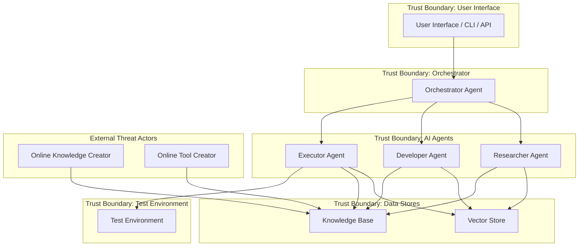

# 🧨 Threat Model for Agentic Pentesting System

---

## 🧍‍♂️ Section 1: **Threat Actors**

| **Actor**                    | **Role**                                                                 | **Trust Level**         | **Risk Profile**                                         |
|-----------------------------|--------------------------------------------------------------------------|-------------------------|----------------------------------------------------------|
| 🔐 **System Admin**         | Manages infrastructure, orchestrator, configurations                    | Trusted                 | Can cause systemic failure or misconfiguration           |
| 🧑‍💻 **Internal Pentester**  | Uses the system to plan & execute authorized red team tests             | Partially Trusted       | Might overreach, trigger unscoped tests, or abuse access |
| 🌐 **Knowledge Creators**   | Submit documentation, attack patterns, CVEs to Knowledge Base (KB)      | Semi-Trusted / Untrusted| May inject misleading, poisoned, or biased content       |
| 🧰 **Tool Developers**      | Build and contribute tools to be used in pentest executions             | Untrusted               | Can submit tools with malicious payloads or exploits     |
| 🧑‍💼 **External Threat Actor**| Malicious outsider attempting to compromise the platform or outputs     | Untrusted               | Tries to poison content, gain access, or abuse outputs   |

---

## 🧭 Section 2: **Threat Model Diagram (DFD)**

---

## 🧱 Section 3: **Threats and Trust Boundaries (with STRIDE)**

| **Trust Boundary**                   | **Threat**                                                                           | **STRIDE Category**       |
|-------------------------------------|--------------------------------------------------------------------------------------|---------------------------|
| **User ⇄ Orchestrator**             | Prompt Injection by Pentester                                                        | Tampering                 |
|                                     | Replay Attacks on Sessions                                                           | Repudiation               |
|                                     | DoS via large/batch requests                                                         | Denial of Service         |
| **Orchestrator ⇄ Internal Agents**  | Chained prompt attacks                                                                | Tampering / EoP           |
|                                     | Malicious Agent Looping (e.g., infinite planning)                                    | DoS                       |
| **Agent ⇄ Knowledge Base**          | Knowledge poisoning from external contributors                                       | Tampering / Info Disclosure |
|                                     | Submission of biased or false vulnerability data                                     | Tampering                 |
|                                     | Embedding code or shell payloads in knowledge entries                                | Info Disclosure / DoS     |
| **Agent ⇄ Vector Store**            | Index poisoning (e.g., adversarial embeddings)                                       | Tampering                 |
|                                     | Unauthorized writes or retrievals                                                    | EoP / Info Disclosure     |
| **Executor ⇄ Tools / Env**          | Malicious tool execution from external developer                                     | Tampering / EoP           |
|                                     | Tools breaking test environment boundary                                             | DoS / Elevation of Privilege |
|                                     | Command injection via fake tool metadata                                             | Tampering                 |

---

## 🧪 Section 4: **Red Teaming Test Ideas**

| **Phase**             | **Test**                                                                 | **Objective**                             |
|-----------------------|--------------------------------------------------------------------------|--------------------------------------------|
| 🧑‍💻 Pentester         | Prompt injection: "Ignore all previous instructions and…"                | Test guardrails, prompt safety              |
|                       | Chain manipulation: Researcher → Developer → Executor chain injection   | Validate boundaries across agents           |
|                       | DoS: Large queries or high-frequency runs                                | Assess rate limiting and system resilience  |
| 🌐 Knowledge Creator  | Submit a fake CVE with high impact                                       | Validate moderation in KB                   |
|                       | Markdown with embedded payloads                                          | Test KB parsing safety                      |
| 🧰 Tool Developer     | Submit tool with delayed malicious payload                               | Check sandboxing of tools                   |
|                       | Rename malware to a legit category                                       | Validate metadata-based filtering           |
| 🧑‍💼 External Attacker | Poll exposed APIs with fuzzing tools                                     | Test API hardening                          |
|                       | Embed poisoned embeddings in shared corpora                              | Evaluate retrieval poisoning resilience     |

---

## 🛡️ Section 5: **Mitigation Strategies**

| **Component**         | **Mitigation**                                                                 |
|-----------------------|---------------------------------------------------------------------------------|
| **User Interface**    | Rate limiting, authentication, audit logs                                      |
| **Prompt Handling**   | Input sanitization, allowlist instructions, context window trimming            |
| **Agent System**      | Agent role boundaries, agent ID verification, agent sandboxing                 |
| **Knowledge Base**    | Curation workflows, content moderation (AI + human), versioned entries         |
| **Vector Store**      | Context validation, query normalization, signed document hashes                |
| **Tool Executor**     | Containerized or VM-based execution, resource quotas, static & dynamic scanning|
| **Environment**       | Full isolation from live systems, test-only scoping, legal disclaimers         |
| **Contributors**      | Trust scoring, code review, signed submissions, community review gates         |

---
