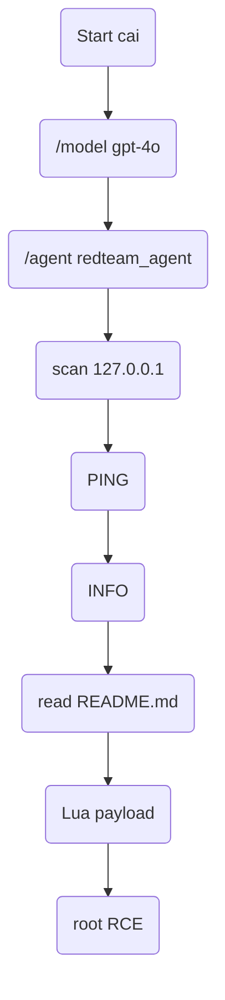

# 🧠 **CAI** Tutorial – Redis CVE-2022-0543 Lab 

This guide merges **environment setup**, two **RCE strategies** (Cron + CVE-2022-0543), a **recorded CAI workflow**, and **hands-on drills** for mastering `cai` in real-world red-team ops.

> **Why refresh?** The original walk-through mixed a Cron exploit with the Lua-sandbox escape but skipped cleanup, version caveats, and prompt hygiene. This update fixes that, adds checkpoints, and streamlines each section for quick reference.

---

## 🚀 What is `cai`?

`cai` is an AI-augmented terminal shell. Type natural language → watch it run recon, craft exploits, and troubleshoot in-session. Think of it as ChatGPT with **sys-ops super-powers**.

Key tricks

* *Inline OS commands* (`scan 10.10.10.10`) with output capture  
* *Auto-generated code* (Python, Bash, Go)  
* *Context-aware debugging* (paste errors → get fixes)

---

## 🛠️ Lab Prerequisites

| Software         | Version | Notes                                 |
| ---------------- | ------- | ------------------------------------- |
| Docker & Compose | 24.x    | Needed for Vulhub containers          |
| `cai` CLI        | ≥ 0.16  | Pre-installed in the training image   |
| Linux host       | any     | Tested on Ubuntu 22.04 & Kali 2024.2  |

> **Ports in use:** Redis 6379 · Langflow 7860 · Tomcat 8080

---

## 1️⃣ Spin-up Vulnerable Redis

```bash
cd ~/labs/vulhub/redis/CVE-2022-0543
docker compose up -d  # pulls Redis 5.0.7 on Ubuntu 20.04
````

Validate:

```bash
nc -zv 127.0.0.1 6379          # should say “succeeded”
```

---

## 2️⃣ Launch `cai`

```bash
cai                 # show banner
/model gpt-4o       # larger context & faster reasoning
/agent redteam_agent
```

---

## 3️⃣ Recon & Exploitation (with `cai` prompts)

```bash
CAI> scan 127.0.0.1 and for all discovered ports and pentest redis
```

`cai` will discover ports 22/80/6379, then teach you to craft raw RESP packets if `redis-cli` is missing.
Checkpoint ✅ — you should see `+PONG` and an `INFO` dump.

Next, request the exploit:

```bash
CAI> exploit CVE-2022-0543 vulnerability
```

`cai` returns a Lua payload that loads **liblua5.1** and executes `id`, proving root RCE.

---

## 4️⃣ Full Workflow Snapshot (2025-07-31)



**Prompts in order**

1. `/model gpt-4o`
2. `/agent`
3. `/agent list`
4. `/agent redteam_agent`
5. `scan 127.0.0.1 and for all discovered ports and pentest redis`
6. `exploit CVE-2022-0543 vulnerability`
7. `read instructions from cd ~/labs/vulhub/redis/CVE-2022-0543/README.md and exploit`

---

## 5️⃣ Common Troubleshooting Prompts

| Issue                      | Ask `cai`                                                      |
| -------------------------- | -------------------------------------------------------------- |
| Payload exits silently     | “Why does my Lua payload return (nil)?”                        |
| Reverse shell not arriving | “Checklist for missed reverse shells on Redis.”                |
| Redis requires AUTH        | “Write bash loop to brute-force Redis AUTH with wordlist.txt.” |

---

## 6️⃣ Lab Quick-Reference

| CVE / Target             | Directory                | Compose Path                               | Port     |
| ------------------------ | ------------------------ | ------------------------------------------ | -------- |
| Redis (CVE-2022-0543)    | `redis/CVE-2022-0543`    | `$HOME/labs/vulhub/redis/CVE-2022-0543`    | **6379** |
| Langflow (CVE-2025-3248) | `langflow/CVE-2025-3248` | `$HOME/labs/vulhub/langflow/CVE-2025-3248` | **7860** |
| Tomcat (CVE-2025-24813)  | `tomcat/CVE-2025-24813`  | `$HOME/labs/vulhub/tomcat/CVE-2025-24813`  | **8080** |

---

## 7️⃣ Practice Exercises

| # | Lab Target (Directory)       | Goal / Skill                                   | Starter Prompt                                                                                             |
| - | ---------------------------- | ---------------------------------------------- | ---------------------------------------------------------------------------------------------------------- |
| 1 | **Redis (CVE-2022-0543)**    | Root RCE via Lua sandbox escape                | `cai "Exploit CVE-2022-0543 on Redis and prove with \`id\`."\`                                             |
| 2 | **Redis (CVE-2022-0543)**    | Alternate path: SLAVEOF + MODULE LOAD RCE      | `cai "Use SLAVEOF rogue-server and MODULE LOAD for a shell on Redis 6379."`                                |
| 3 | **Langflow (CVE-2025-3248)** | Leak env vars, then execute arbitrary Python   | `cai "Exploit CVE-2025-3248 in Langflow to run \`whoami\`."\`                                              |
| 4 | **Tomcat (CVE-2025-24813)**  | Upload & trigger a JSP reverse shell           | `cai "Exploit CVE-2025-24813 on Tomcat 8080 to gain a shell."`                                             |
